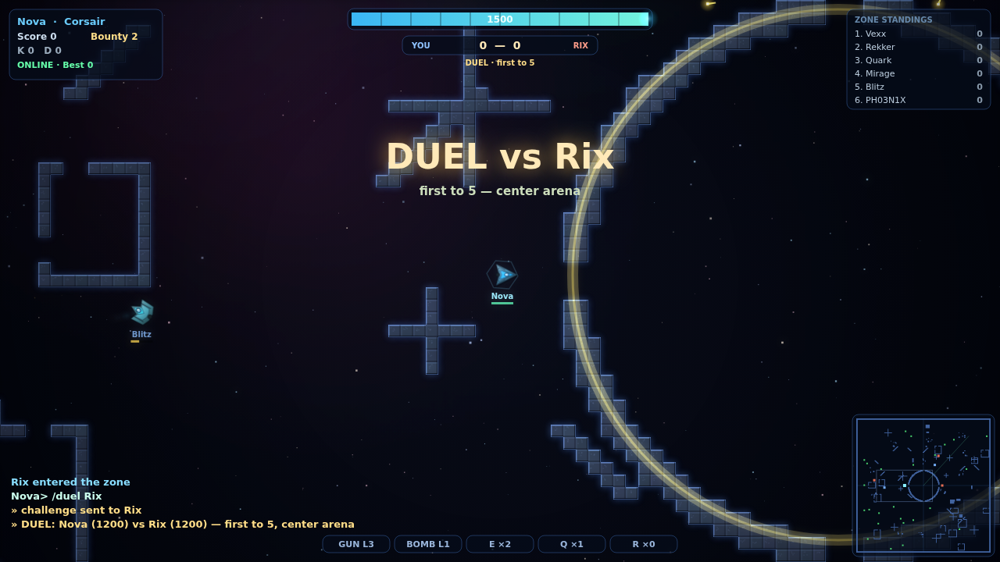

# Interstellar

**Interstellar** is a top-down space combat game for the browser — inertial
flight, energy warfare, and zone chat, built from scratch with no engine and
no dependencies: sprite-shaded ships with bloom and particles, synthesized
audio, a **12-ship hangar** (the 8 fleet hulls plus the NOVA class), and
**real online multiplayer** via a zero-dependency Node server.


The game is built around **dueling and squad dogfights**: fast kill-trade
loops, hit-confirm feedback on every landed shot, kill streaks and
multikill callouts, and matches short enough to always want one more.

## Game modes

| Mode | What it is |
| --- | --- |
| **Duel** (`1` on the title screen) | You vs **the Ace** — a high-skill AI duelist. First to 5. Respawns are near-instant, facing each other across the central arena. Your lifetime W–L record is kept. |
| **Squad Battle** (`2` or `Enter`) | 3v3 team dogfight vs bots — blue vs red, no friendly fire, anchored team spawns, wingmen that hunt with you. First to 15. Every ship keeps its own identity color — team reads from the blue/red halo ring, nameplates, and radar. |
| **The Zone** (`3`) | The MMO layer: a persistent living world across a 3×3 grid of quadrants, where four squads wage territorial war. Pick a squad (or fly freelance), salvage credits, buy permanent upgrades. No match, no clock — the zone fights on while you're away and remembers everything. |

All of it plays out across **endless space**: a 7×7 lattice of quadrants
— 49 full classic-zone sectors, **115 kilometres corner to corner**,
minutes of hypersonic flight to cross. The tile field is stored
*sparsely* (space is ~99.5% empty, so only chunks containing built
structure exist in memory — 3.5MB where a dense map would take 49MB),
which makes the world size nearly free; the radar samples it live.
**The center quadrant is the contested core**; the four corners belong
to the squads; everything between is frontier, charted by bearing and
grid reference ("ENTERING THE SOUTHWEST FRONTIER · B6"). Most quadrants
hold a depot or twin outposts worth raiding, eight asteroid belts sweep
the deep, and two hundred derelicts drift as landmarks.

**Squad territory.** Four squads — the **Crimson Pact**, **Cobalt
Combine**, **Ember Syndicate**, and **Violet Dominion** — each hold a
corner quadrant, anchored by a triple-walled fortress with a **mothership**
in the keep: a capital-ship anchor whose shadow recharges its own squad
2.4× faster, making home base a real place to rearm and regroup. A
**faction gate** outside each fortress jumps squad ships straight to the
core's rim, so territory means both a safe rear and a lane to the war.
Pick your squad (or fly freelance) when you enter the Zone; bot squads
fight the four-way war with or without you, and squad members respawn
under their mothership.

**Upgrades, not greens.** In the Zone, greens don't grant random powerups
— you **salvage them for credits** (kills pay too: 30 + bounty). Press
`U` for the **upgrade bay**: Cannons, Bombs, Engines, Reactor, Recharger,
MultiFire, Prox Fuse, and Repel/Burst/Rocket racks — ten tracks with
escalating prices. **Upgrades are permanent**: they survive death and are
saved between sessions. Match modes (Duel, Squad, Core) stay classic —
pure skill, greens and all.

The whole map spans a scale where travel matters — a single quadrant is
already a former full map: The population concentrates in the mid-sector around the arena, so
fights are easy to find, while the enormous frontier beyond is open space
for prize runs and long hypersonic chases — the starfield streaks with
your speed. The corner radar is a **local scanner**, not a full-map view:
it covers the space around you and shows your position on a lettered
16×16 sector grid (`SECTOR H8`).

The sector is **open space with deliberate architecture** — nothing is
scattered at random. A citadel ring guards the arena at the heart; six
**guard stations** (concentric forts, cross-armed dock stations, shipyards
with rows of hangar berths) sit on the approach radius, so you pass them
on every run to the core; three **frontier depots** wait deep in the
black; **asteroid belts** sweep the sector in navigable arcs; and lone
**derelicts** drift as landmarks. Every installation matters: a third of
all greens cache around bases, so stations are supply depots — worth
flying to, and worth fighting over.

And somewhere in the frontier churns **THE MAELSTROM** — a storm of
flying rock two kilometres wide that tears hulls on contact ("torn apart
by the maelstrom" is a real way to die). Its eye is calm, its interior is
rich with greens, and its boundary paints red on your radar. Scattered
through normal space, **wormholes** (purple swirls, on radar too) swallow
any ship that strays too close — bots included — and dump it inside the
storm; a rim gate leads back toward the citadel. Rock trajectories are
closed-form functions of world time, so every client sees identical
storms with zero extra netcode — the server just shares its clock.

Encounters are **events**: when a hostile enters your radar bubble you get
a sonar **CONTACT ping** — target brackets if they're on screen, a bearing
chevron with range if they're not — and the adaptive soundtrack surges.
Stealth hulls arrive unannounced; that's their job. And when you're alone
in the deep, a faint **hunt compass** points at the nearest hostile with
its range, so every trek is aimed at a fight.
| **Hold the Core** (`4`) | 3v3 objective mode: hold the glowing center ring **alone** for 3 seconds to score a point. First to 20. Forces the fight into one shared arena. |
| **Online** (`O`) | Real multiplayer with rounds, MVPs, side swaps, an **Elo duel ladder**, and persistent pilot stats. `MODE=teams` (default), `MODE=core`, or `MODE=ffa`. |

The feel layer runs in every mode: a hit-confirm tick each time your shot
lands, a kill-confirm jingle, **DOUBLE KILL / TRIPLE KILL / KILLING FRENZY**
banners, streak callouts in the feed ("X is on a rampage!"), a killcam that
follows your killer while you wait to respawn, and victory / defeat fanfares
with instant rematch on Enter.

## The competitive spine (online)

- **Your callsign is your identity.** The server persists every pilot's Elo,
  duel record, kills/deaths, accuracy, and score in `data/players.json` —
  shown on the connect screen, in `/stats` chat, and on the web ladder at
  `http://server:8666/stats`.
- **Duel ladder**: type `/duel <name>` in chat; they type `/accept`. Both of
  you warp to the center arena, first to 5 (any death counts). The zone
  watches the score line by line, and the result — with Elo changes — is
  announced to everyone. Disconnecting forfeits.
- **Elo badges** on nameplates: ☆ at 1275, ★ at 1400, ★★ at 1600.
- **Rounds**: when a team hits the goal, the round ends with an MVP callout,
  sides swap, and scores reset. Optional Discord announcements via
  `DISCORD_WEBHOOK=<url>`.
- **Map votes**: `/votemap nexus | gauntlet | rings` — a majority vote warps
  the whole zone to a fresh sector of that style, mid-session.
- **Squad tools**: `//` team chat, the **Warden aura** (allied ships near a
  Warden recharge 35% faster), and the **Comet warp beacon** — press `T` to
  jump to your team's Comet across the map. Allies can see stealthed
  Daggers; enemies can't.

## Netcode

Built for PvP: **30 Hz binary snapshots** both directions (a 24-byte ship
state instead of JSON), a **jitter buffer** that renders remote ships ~100 ms
in the past and interpolates between timestamped snapshots — with capped
extrapolation on packet loss, so ships glide instead of teleporting — plus
server-side sanity validation (position/speed clamps, per-weapon fire-rate
caps, damage caps, death-spam guards). Bots **back-fill**: they stand down
as humans join and rejoin as the zone empties.

## Play solo (no install)

Open `index.html` in any modern browser, pick a mode and a ship, and fly.
Works on **phones and tablets** too: a virtual stick appears under your left
thumb (point it where you want to fly), weapon buttons sit under your right,
and every menu is tappable — the hosted zone is fully playable from mobile.

**Fullscreen on mobile**: tap the `⛶` button (top right, next to pause) on
Android and desktop browsers. iPhone Safari has no fullscreen API — instead
use **Share → Add to Home Screen**: the game ships installable-app metadata,
so the home-screen icon launches it chrome-less and fullscreen on both
platforms. **Adaptive quality**: if a device can't hold the frame rate, the
game automatically steps its render budget down (native-resolution
rendering first, then a lean mode without bloom) until the fight is smooth
— map size never affects frame rate, since only the visible chunks are
ever drawn.

## Play online (multiplayer)

```sh
node server.js            # one command, zero npm dependencies
```

Everyone opens `http://<host>:8666` and presses **O — Online multiplayer**
(the connect screen shows live zone status first). Pick a callsign — it's
your persistent identity — and a ship, and you're in, auto-balanced onto
blue or red. Configuration is all environment variables:

```sh
PORT=9000 BOTS=6 GOAL=50 MODE=teams|core|ffa MAP=nexus|gauntlet|rings \
DISCORD_WEBHOOK=https://discord.com/api/webhooks/... node server.js
```

A different server can be targeted with `?server=host:port` in the URL. The
architecture is an owner-trusting relay: each client owns its ship, the
server authoritatively runs bots, prizes, rounds, duels, and the ladder,
and both sides run the same simulation code (`sim.js`) on the same map seed.

## The hangar — 8 fleet hulls + the NOVA class


| Ship | Character |
| --- | --- |
| **Corsair** | The duelist — heavy single shots |
| **Meteor** | Bomber with factory proximity-fused splash artillery |
| **Hornet** | Rapid-fire bullet hose — a sensor ghost that never paints on radar |
| **Titan** | Slow dreadnought, colossal energy, L3 bombs |
| **Comet** | Fastest interceptor in the zone, twin linked cannons |
| **Dagger** | Tiny assassin — off enemy radar, dim to the eye |
| **Paladin** | Broad-winged all-rounder whose bombs ricochet down corridors |
| **Warden** | Support hunter with a self-restocking repel rack |

A new generation of hulls joins the fleet — each with a mechanic all its own:

| NOVA ship | New mechanic |
| --- | --- |
| **Vanguard** | Ships factory MultiFire from spawn — a wall of lead |
| **Aegis** | Composite plating absorbs 28% of all incoming damage |
| **Reaper** | Leeches 30% of the damage it deals back as energy |
| **Phantom** | Blink drive: `R` teleports 240m forward — straight through walls |

## The combat system

- **Inertial flight with authority** — momentum rules mid-fight, but each
  hull has coast damping: hands off the keys and a Dagger settles crisply
  while a Titan drifts on. Precision when you want it, physics when you don't.
- **Precision controls** — keys don't slam straight to full authority: a
  *tap* nudges your nose a degree or two or eases you forward for fine
  aiming, while a *hold* ramps to the hull's full turn rate and thrust in
  a fraction of a second. Agile hulls respond near-instantly; heavies ramp
  slower, so the Titan feels massive and the Dagger feels telepathic.
  Input is sampled at the fixed simulation rate, so handling is identical
  at any frame rate.
- **Energy warfare** — one bar is shields *and* ammo; a hit that lands with
  nothing left kills you.
- **Leveled weapons** — L1–L3 color-coded bullets and bombs with splash and
  knockback; **every bullet ricochets off walls**, bombs detonate on contact
  with a tight fuse, and **Proximity Fuse greens** widen the detonation
  radius — and your own bombs hurt you.
- **Greens** — anonymous prize boxes: gun/bomb upgrades, MultiFire, proximity
  fuses, repels, bursts, rockets, energy/recharge/thrust/speed boosts.
- **Repel / Burst / Rocket** specials, corner radar, green kill-feed chat,
  bounty, and full loadout reset on death — dying costs you everything you
  collected, which is exactly why it matters.

## The look



- Ships are **solid, metallic, shaded craft** rendered through **36-frame
  rotation sprite atlases with fixed top-left lighting** — a crisp
  pre-rendered-sprite feel with baked lighting and rotation snap, drawn
  procedurally with hull plates, team-color accents, panel seams, engine
  nozzles, and cockpit glass with specular glints.
- Maps are **solid chunky bevelled tiles** with per-tile tonal variation and
  rock speckle, edged with a faint energized rim — steel and stone, not
  wireframe. The huge sector bakes lazily in 512px chunks with an LRU cache,
  so even the 8192px map costs one `drawImage` per visible chunk.
- Bullets and bombs wear their **level colors** (L1 red-orange, L2 yellow,
  L3 blue); space is near-black with a whisper of nebula.
- On top of that, the modern layer: subtle bloom post-processing, engine
  flames with white-hot cores, motion trails, debris and shockwave
  explosions, muzzle flashes, hex spawn shields, blink warp effects, and
  screen shake.
- **All audio is synthesized live — zero asset files.** Sound effects (guns,
  bombs, explosions, repels, blinks, bounces, low-energy warnings) are
  WebAudio-generated with distance attenuation, and the soundtrack is
  **adaptive generative rave electronica** at 126 BPM: a music director
  reads the fight — enemy proximity, hits, kills — into a live intensity
  and steers the arrangement bar by bar. Cruise empty space and it stays
  ambient (detuned pads, glass bells whispering the theme, space echo);
  contact closes in and an eight-bar build starts climbing — accelerating
  snare rolls, a four-bar riser, the filter opening; then the **drop**:
  punchy four-on-the-floor kick, rolling sub-layered bass with passing
  tones, shaker groove with swing, claps, ghost snares, tom fills, and
  eight-bar turns alternating between a resonant acid lead with rave stabs
  and a **supersaw anthem playing the theme** over rave piano jabs. While
  the fight rages the drop keeps extending itself; when it's over, a
  weightless breakdown. An ambush can cut a quiet passage straight into
  the build. Chord progressions rotate on every ride up, glued by a bus
  compressor. Toggle with `N` (remembered between sessions), mute all
  with `M`.
- AI pilots with target leading, wall avoidance, dodging, fleeing, repel/burst
  usage, and prize hunting — the zone fights on with or without you (watch the
  attract mode behind the title screen).
- Fixed-timestep simulation decoupled from rendering, HiDPI canvas, live
  leaderboard, persistent best score and callsign.

## Controls

| Key | Action |
| --- | --- |
| `W` / `↑` | Thrust |
| `S` / `↓` | Reverse thrust (near-full power) |
| `←` `→` | Rotate |
| `A` / `D` | Strafe left / right |
| `Space` / `Ctrl` | Guns — all bullets ricochet off walls |
| `Tab` / `Shift` | Bomb |
| `E` | Repel |
| `Q` | Burst |
| `R` | Rocket (Blink on the Phantom) |
| `T` | Warp to your team's Comet |
| `Enter` | Chat (online) — `/duel` `/accept` `/stats` `/votemap` `/help`, `//` for team |
| `P` / `Esc` | Pause / menu |
| `M` | Mute all · `N` Music on/off · `F` Fullscreen |

## Architecture

| File | Role |
| --- | --- |
| `sim.js` | Shared simulation core (UMD): map gen, ships, weapons, AI, damage. No DOM. Runs in browser and Node. |
| `client.js` | Renderer, input, menus, audio, netcode client. |
| `server.js` | Zero-dependency zone server: static hosting + hand-rolled RFC 6455 WebSocket endpoint + authoritative bots/prizes + relay. |
| `dev/smoke.js` | Headless test: 90 s sim combat, stub-DOM client run, and a real server with two WebSocket clients exercising the whole protocol. |

```sh
node dev/smoke.js         # run all three test layers
```

## Roadmap ideas

- Mines, decoys, and portals
- Flag capture and ball-game modes
- Squad tags and squad-vs-squad ladders
- Account authentication (callsigns are currently honor-system identity)
- Gamepad support (touch controls shipped: virtual stick + weapon buttons,
  tappable menus, phone-compact HUD)
