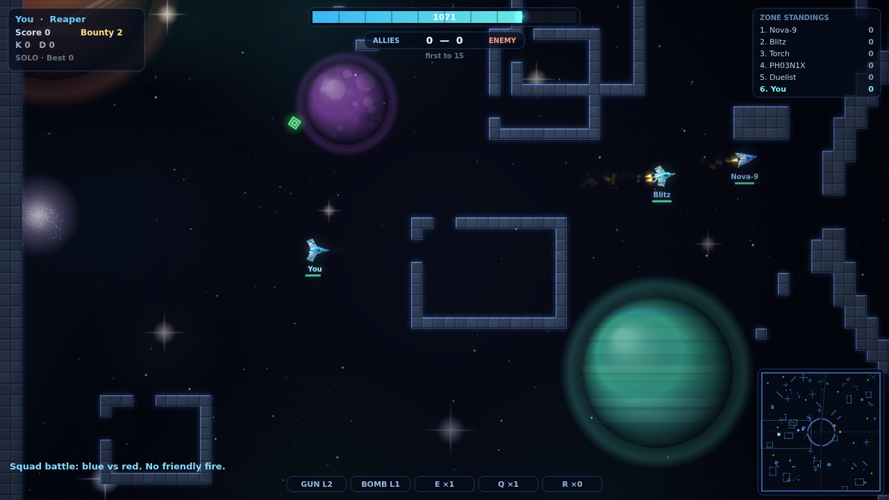
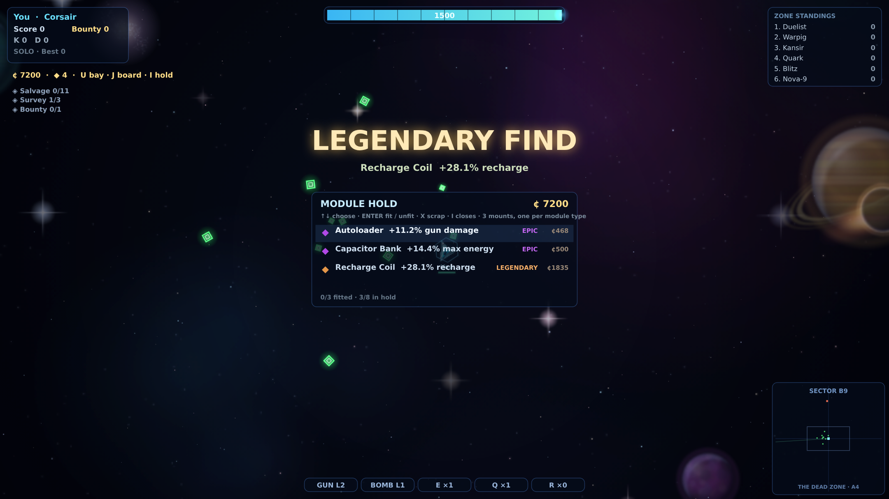
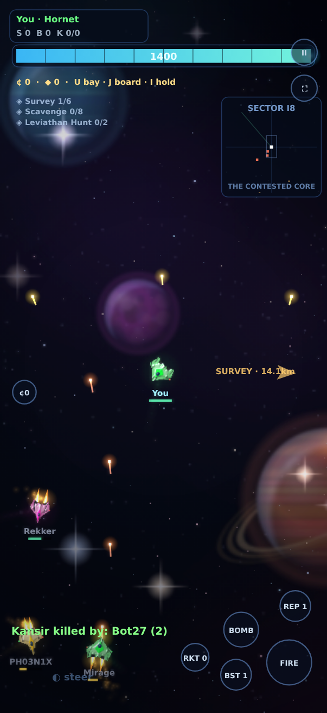
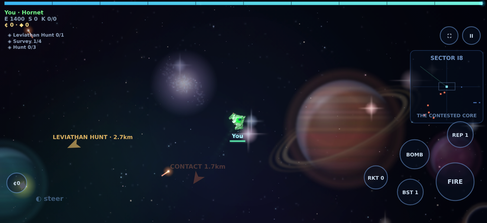
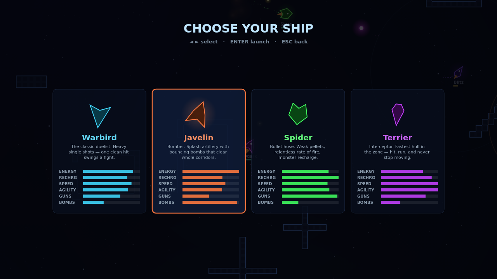
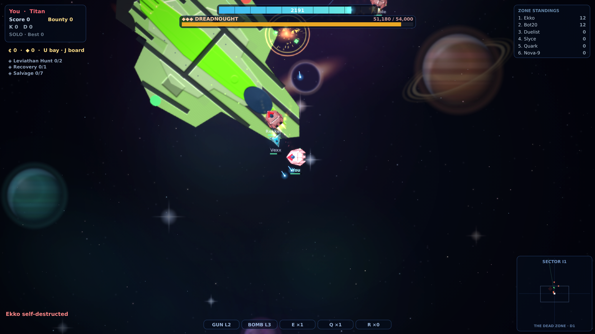
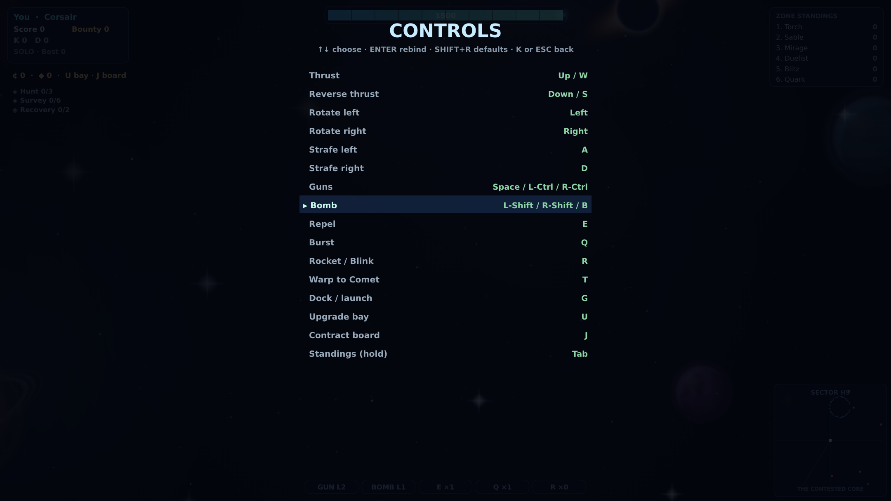

# Interstellar

**Interstellar** is a top-down space combat game for the browser — inertial
flight, energy warfare, and zone chat, built from scratch with no engine and
no dependencies: sprite-shaded ships with bloom and particles, synthesized
audio, a **12-ship hangar** (the 8 fleet hulls plus the NOVA class), and
**real online multiplayer** via a zero-dependency Node server.



The game is built around **dueling and squad dogfights**: fast kill-trade
loops, hit-confirm feedback on every landed shot, kill streaks and
multikill callouts, and matches short enough to always want one more.

## Game modes

| Mode | What it is |
| --- | --- |
| **Duel** (`1` on the title screen) | You vs **the Ace** — a high-skill AI duelist. First to 5. Respawns are near-instant, facing each other across the central arena. Your lifetime W–L record is kept. |
| **Squad Battle** (`2` or `Enter`) | 3v3 team dogfight vs bots — blue vs red, no friendly fire, anchored team spawns, wingmen that hunt with you. First to 15. Every ship keeps its own identity color — team reads from the blue/red halo ring, nameplates, and radar. |
| **The Zone** (`3`) | The MMO layer: a persistent living world across a 3×3 grid of quadrants, where four squads wage territorial war. Pick a squad (or fly freelance), salvage credits, buy permanent upgrades. No match, no clock — the zone fights on while you're away and remembers everything. |

All of it plays out across **endless space**: a 7×7 lattice of quadrants
— 49 full classic-zone sectors, **115 kilometres corner to corner**,
minutes of hypersonic flight to cross. The tile field is stored
*sparsely* (space is ~99.5% empty, so only chunks containing built
structure exist in memory — 3.5MB where a dense map would take 49MB),
which makes the world size nearly free; the radar samples it live.
**The center quadrant is the contested core**; the four corners belong
to the squads; everything between is frontier, charted by bearing and
grid reference ("ENTERING THE SOUTHWEST FRONTIER · B6"). Most quadrants
hold a depot or twin outposts worth raiding, eight asteroid belts sweep
the deep, and two hundred derelicts drift as landmarks.

**Squad territory.** Four squads — the **Crimson Pact**, **Cobalt
Combine**, **Ember Syndicate**, and **Violet Dominion** — each hold a
corner quadrant, anchored by a triple-walled fortress with a **mothership**
in the keep: a capital-ship anchor whose shadow recharges its own squad
2.4× faster, making home base a real place to rearm and regroup. A
**faction gate** outside each fortress jumps squad ships straight to the
core's rim, so territory means both a safe rear and a lane to the war.
Pick your squad (or fly freelance) when you enter the Zone; bot squads
fight the four-way war with or without you, and squad members respawn
under their mothership.

**Territorial war.** Squads **capture quadrants**: sole majority presence
in a frontier quadrant for 45 accumulated seconds flips it — the chart
updates ("D2 · CRIMSON HELD"), the capture is announced sector-wide,
participants earn credits, and held ground recharges its holders' hulls
30% faster. Home quadrants never fall, the core is forever contested, and
no law reaches the Dead Zone.

**Your wing.** Fly for a squad and a named wing (TALON, HALO, CINDER,
SHADE) forms on you — two squadmates who hold formation off your stern,
hunt what you hunt, and fall on whoever falls on you.

**Capital ships.** Each squad's **carrier** is a 300-metre hull rendered
through the *same* heightmap → albedo → per-pixel lighting bake as the
fighters, so it reads as the same fleet at ten times the scale — and it is
**under way**, patrolling its quadrant rather than parked. Fly into its
shadow and press `G` to **dock**: you ride along inside the bay, untouchable,
refitting at four times the normal rate, until you press `G` to launch. Its
course is a closed-form epicycle from the world seed, so every peer sees the
carrier in the same place with no position netcode at all.

**Boss hunts.** Three classes of hostile capital prowl the frontier, and they
range from soloable to a squad wall:

| Boss | Where | Hull | Payout |
| --- | --- | --- | --- |
| ◆ **Reaver** | open frontier (×3) | 5,200 | ¢850 · ◆1 |
| ◆◆ **Leviathan** | the Maelstrom | 21,000 | ¢2,600 · ◆2 |
| ◆◆◆ **Dreadnought** | the Dead Zone | 54,000 | ¢7,200 · ◆4 |

They fly their own patrols, fire batteries of turrets at anything in range
(everyone is an enemy), ram like a wall, and shed a cloud of greens when they
break up. Get within engagement range and a tiered hull bar takes the top of
your screen. Bullets chip them; **bombs are how you actually crack one**.
They respawn at their lair on a timer, so a lair is a place you can farm —
if you can take it. Carry a **Leviathan Hunt** contract and the course
pointer aims straight at the nearest living boss.

**Contracts.** You always carry three, and they complete from what you'd be
doing anyway — Hunt, Bounty (marauder heads), Salvage, Scavenge (derelict
caches), Recovery (relics), Survey (chart new quadrants), and Conquest (help
take ground). Each pays credits and is replaced the moment it's done, so the
deep frontier always has a reason to be out there. `J` opens the board;
progress persists with your pilot.

**Finding the fight.** Every contract drives a **course pointer**: a gold
chevron at the screen edge aiming at the nearest live objective — the boss
lair, a marauder, an uncracked cache, an uncharted quadrant — with its
distance. `V` cycles which contract it tracks. For the return leg, `T`
**warps you home** to your mothership (freelancers ride to the contested
core) and `Y` drops a **waypoint beacon** you can warp back to — both cost
450 energy on a shared 25-second cooldown, so they're travel, not escape.

**A frontier that's inhabited.** Two hundred **derelict caches** drift across
the map — quick amber salvage worth credits, respawning, visible on the
scanner. Half the zone's ships fly **patrol routes over assigned quadrants**
rather than clustering at the core, so a long burn runs into somebody. The
**Dead Zone keeps a standing pirate presence**, and generated events fire
roughly twice as often as the sector's other hazards.

**Upgrades, not greens.** In the Zone, greens don't grant random powerups
— you **salvage them for credits** (kills pay too: 30 + bounty). Press
`U` for the **upgrade bay**: Cannons, Bombs, Engines, Reactor, Recharger,
MultiFire, Prox Fuse, and Repel/Burst/Rocket racks — ten tracks with
escalating prices. **Top tiers demand ◆ relics**: rare tech cached only
in dangerous places — the Maelstrom's heart, the Dead Zone, *rival
fortress quadrants*, and the deep belts. **Upgrades are permanent**: they
survive death and are saved between sessions. Match modes (Duel, Squad,
Core) stay classic — pure skill, greens and all.

**Finds: the rarity ladder.** Layered over the credit economy, **modules**
drop from the things you already fight — derelict caches, marauders, and
every boss kill — in four tiers: <ins>common</ins> green, **rare** blue,
**epic** purple, **legendary** orange. A module is a permanent stat package
(Afterburner, Capacitor Bank, Recharge Coil, Autoloader, Warhead Pack,
Deflector Plate, Prox Trigger, Salvage Scoop); rarity multiplies it and a
power roll keeps two drops of the same tier from being identical. You fly
three **mounts**, one per module type — press `I` for the hold, fit and
unfit freely, scrap the rest for credits. The Dreadnought's first drop is
**always a legendary**, and a legendary on the field throws a beacon of
light you can see from a fight away.



**The Dead Zone.** One edge quadrant belongs to nobody and never will:
marauder country, relic-rich, storm-scored on the soundtrack. High risk,
highest reward.

**Generated events force action.** On a deterministic timeline (identical
for every client, no netcode), the sector throws: **asteroid showers**
that rake a quadrant with streaking rock; **marauder raids** — pirate
packs hostile to everyone, worth fat bounties, whose survivors *prowl the
sector until somebody collects*; and **stellar collapse** — an 18-second
evacuation warning, then a supernova shockwave that expands three
kilometres and hits like a freight train. Every event is announced with
its chart reference and pulses on the scanner.

The whole map spans a scale where travel matters — a single quadrant is
already a former full map: The population concentrates in the mid-sector around the arena, so
fights are easy to find, while the enormous frontier beyond is open space
for prize runs and long hypersonic chases — the starfield streaks with
your speed. The corner radar is a **local scanner**, not a full-map view:
it covers the space around you and shows your position on a lettered
16×16 sector grid (`SECTOR H8`).

The sector is **open space with deliberate architecture** — nothing is
scattered at random. A citadel ring guards the arena at the heart; six
**guard stations** (concentric forts, cross-armed dock stations, shipyards
with rows of hangar berths) sit on the approach radius, so you pass them
on every run to the core; three **frontier depots** wait deep in the
black; **asteroid belts** sweep the sector in navigable arcs; and lone
**derelicts** drift as landmarks. Every installation matters: a third of
all greens cache around bases, so stations are supply depots — worth
flying to, and worth fighting over.

And somewhere in the frontier churns **THE MAELSTROM** — a storm of
flying rock two kilometres wide that tears hulls on contact ("torn apart
by the maelstrom" is a real way to die). Its eye is calm, its interior is
rich with greens, and its boundary paints red on your radar. Scattered
through normal space, **wormholes** (purple swirls, on radar too) swallow
any ship that strays too close — bots included — and dump it inside the
storm; a rim gate leads back toward the citadel. Rock trajectories are
closed-form functions of world time, so every client sees identical
storms with zero extra netcode — the server just shares its clock.

Encounters are **events**: when a hostile enters your radar bubble you get
a sonar **CONTACT ping** — target brackets if they're on screen, a bearing
chevron with range if they're not — and the adaptive soundtrack surges.
Stealth hulls arrive unannounced; that's their job. And when you're alone
in the deep, a faint **hunt compass** points at the nearest hostile with
its range, so every trek is aimed at a fight.
| **Hold the Core** (`4`) | 3v3 objective mode: hold the glowing center ring **alone** for 3 seconds to score a point. First to 20. Forces the fight into one shared arena. |
| **Online** (`O`) | Real multiplayer with rounds, MVPs, side swaps, an **Elo duel ladder**, and persistent pilot stats. `MODE=teams` (default), `MODE=core`, or `MODE=ffa`. |

The feel layer runs in every mode: a hit-confirm tick each time your shot
lands, a kill-confirm jingle, **DOUBLE KILL / TRIPLE KILL / KILLING FRENZY**
banners, streak callouts in the feed ("X is on a rampage!"), a killcam that
follows your killer while you wait to respawn, and victory / defeat fanfares
with instant rematch on Enter.

## The competitive spine (online)

- **Your callsign is your identity — and it's registered.** The first
  flight under a name mints a random 128-bit token; the client keeps it,
  the server keeps only its hash, and later joins claiming that name
  without the token are refused. The server persists every pilot's Elo,
  duel record, kills/deaths, accuracy, and score in `data/players.json`
  (`DATA_DIR` overrides the location) — shown on the connect screen, in
  `/stats` chat, and on the web ladder at `http://server:8666/stats`.
- **Duel ladder**: type `/duel <name>` in chat; they type `/accept`. Both of
  you warp to the center arena, first to 5 (any death counts). The zone
  watches the score line by line, and the result — with Elo changes — is
  announced to everyone. Disconnecting forfeits.
- **Elo badges** on nameplates: ☆ at 1275, ★ at 1400, ★★ at 1600.
- **Rounds**: when a team hits the goal, the round ends with an MVP callout,
  sides swap, and scores reset. Optional Discord announcements via
  `DISCORD_WEBHOOK=<url>`.
- **Map votes**: `/votemap nexus | gauntlet | rings` — a majority vote warps
  the whole zone to a fresh sector of that style, mid-session.
- **Squad tools**: `//` team chat, the **Warden aura** (allied ships near a
  Warden recharge 35% faster), and the **Comet warp beacon** — press `T` to
  jump to your team's Comet across the map. Allies can see stealthed
  Daggers; enemies can't.

## Netcode

Built for PvP: **30 Hz binary snapshots** both directions (a 24-byte ship
state instead of JSON), a **jitter buffer** that renders remote ships ~100 ms
in the past and interpolates between timestamped snapshots — with capped
extrapolation on packet loss, so ships glide instead of teleporting — plus
server-side sanity validation (position/speed clamps, per-weapon fire-rate
caps, damage caps, death-spam guards). Bots **back-fill**: they stand down
as humans join and rejoin as the zone empties.

## Play solo (no install)

Open `index.html` in any modern browser, pick a mode and a ship, and fly.



Works on **phones and tablets** too — **portrait or landscape**. Landscape
is its own layout, not a squeezed desktop: your ship sits at the centre of
a ~400px-tall view, so the **combat ring** — the annulus you actually watch
for incoming — runs straight through the top edge, and anything wide and
centred up there blinds you in three directions at once. So the status
bars become **hairlines flush to the top edge**, announcements collapse to
one compact line, the text columns hug the sides outside the ring, the
scanner sits clear of the weapon cluster, and the thumb targets grow
(landscape has width to spare). `dev/mobile-audit.js` measures it: the HUD
covers **1.1% of the combat ring at rest** in landscape, with no direction
worse than 9%. A virtual stick appears under your left
thumb (point it where you want to fly), weapon buttons sit under your right,
and every menu is tappable — the hosted zone is fully playable from mobile.

**Fullscreen on mobile**: tap the `⛶` button (top right, next to pause) on
Android and desktop browsers. iPhone Safari has no fullscreen API — instead
use **Share → Add to Home Screen**: the game ships installable-app metadata,
so the home-screen icon launches it chrome-less and fullscreen on both
platforms. **Adaptive quality**: if a device can't hold the frame rate, the
game automatically steps its render budget down (native-resolution
rendering first, then a lean mode without bloom) until the fight is smooth
— map size never affects frame rate, since only the visible chunks are
ever drawn.

## Play online (multiplayer)

```sh
node server.js            # one command, zero npm dependencies
```

Everyone opens `http://<host>:8666` and presses **O — Online multiplayer**
(the connect screen shows live zone status first). Pick a callsign — it's
your persistent identity — and a ship, and you're in, auto-balanced onto
blue or red. Configuration is all environment variables:

```sh
PORT=9000 BOTS=6 GOAL=50 MODE=teams|core|ffa MAP=nexus|gauntlet|rings \
DISCORD_WEBHOOK=https://discord.com/api/webhooks/... node server.js
```

A different server can be targeted with `?server=host:port` in the URL. The
architecture is an owner-trusting relay: each client owns its ship, the
server authoritatively runs bots, prizes, rounds, duels, and the ladder,
and both sides run the same simulation code (`sim.js`) on the same map seed.

## The hangar — 8 fleet hulls + the NOVA class



| Ship | Character |
| --- | --- |
| **Corsair** | The duelist — heavy single shots |
| **Meteor** | Bomber with factory proximity-fused splash artillery |
| **Hornet** | Rapid-fire bullet hose — a sensor ghost that never paints on radar |
| **Titan** | Slow dreadnought, colossal energy, L3 bombs |
| **Comet** | Fastest interceptor in the zone, twin linked cannons |
| **Dagger** | Tiny assassin — off enemy radar, dim to the eye |
| **Paladin** | Broad-winged all-rounder — **the only hull whose bombs ricochet**, three times, down corridors |
| **Warden** | Support hunter with a self-restocking repel rack |

A new generation of hulls joins the fleet — each with a mechanic all its own:

| NOVA ship | New mechanic |
| --- | --- |
| **Vanguard** | Ships factory MultiFire from spawn — a wall of lead |
| **Aegis** | Composite plating absorbs 28% of all incoming damage |
| **Reaper** | Leeches 30% of the damage it deals back as energy |
| **Phantom** | Blink drive: `R` teleports 240m forward — straight through walls |

## The combat system

- **Inertial flight with authority** — momentum rules mid-fight, but each
  hull has coast damping: hands off the keys and a Dagger settles crisply
  while a Titan drifts on. Precision when you want it, physics when you don't.
- **Precision controls** — keys don't slam straight to full authority: a
  *tap* nudges your nose a degree or two or eases you forward for fine
  aiming, while a *hold* ramps to the hull's full turn rate and thrust in
  a fraction of a second. Agile hulls respond near-instantly; heavies ramp
  slower, so the Titan feels massive and the Dagger feels telepathic.
  Input is sampled at the fixed simulation rate, so handling is identical
  at any frame rate.
- **Energy warfare** — one bar is shields *and* ammo; a hit that lands with
  nothing left kills you.
- **Leveled weapons** — L1–L3 color-coded bullets and bombs with splash and
  knockback; **every bullet ricochets off walls**, while **bouncing bombs are
  a hull specialty** (the Paladin's, and only the Paladin's) — everyone else's
  detonate on the wall they hit. Bomb fuses are **forgiving**: a near miss
  still counts, and **Proximity Fuse greens** widen the ring a lot further.
  Your own bombs still hurt you.
- **Greens** — anonymous prize boxes: gun/bomb upgrades, MultiFire, proximity
  fuses, repels, bursts, rockets, energy/recharge/thrust/speed boosts.
- **Repel / Burst / Rocket** specials, corner radar, green kill-feed chat,
  bounty, and full loadout reset on death — dying costs you everything you
  collected, which is exactly why it matters.

## The look



- Ships are **solid, metallic, shaded craft** rendered through **36-frame
  rotation sprite atlases with fixed top-left lighting** — a crisp
  pre-rendered-sprite feel with baked lighting and rotation snap, drawn
  procedurally with hull plates, team-color accents, panel seams, engine
  nozzles, and cockpit glass with specular glints.
- Maps are **solid chunky bevelled tiles** with per-tile tonal variation and
  rock speckle, edged with a faint energized rim — steel and stone, not
  wireframe. The huge sector bakes lazily in 512px chunks with an LRU cache,
  so even the 8192px map costs one `drawImage` per visible chunk.
- Bullets and bombs wear their **level colors** (L1 red-orange, L2 yellow,
  L3 blue); space is near-black with a whisper of nebula.
- On top of that, the modern layer: subtle bloom post-processing, engine
  flames with white-hot cores, motion trails, debris and shockwave
  explosions, muzzle flashes, hex spawn shields, blink warp effects, and
  screen shake.
- **All audio is synthesized live — zero asset files.** Sound effects (guns,
  bombs, explosions, repels, blinks, bounces, low-energy warnings) are
  WebAudio-generated with distance attenuation, and the soundtrack is
  **uplifting space trance** — one musical identity for the whole game:
  A minor, 138 BPM, four-on-the-floor with **offbeat bass**, wide add9
  saw pads, **six-voice detuned supersaws** panned across the stereo
  field, and a **sidechain pump** — every kick ducks the entire tonal
  stem and it swells back between beats. A music director reads the
  fight — enemy proximity, hits, kills — into a live intensity and
  steers the arrangement bar by bar: cruise empty space and it stays
  weightless (pads, glass bells whispering the game's two-bar theme,
  dotted-8th space echo); contact closes in and an eight-bar build
  climbs — the offbeat bass arrives, the arp's filter opens, a riser
  sweeps four octaves into an accelerating snare roll; then the
  **drop**, riding eight-bar turns that alternate the **supersaw anthem**
  (the theme, long proud notes over rave piano jabs) with a
  filter-breathing **arp ride**. While the fight rages the drop keeps
  extending itself; when it's over, a crash washes out into a
  breakdown. An ambush can cut a quiet passage straight into the build.
  WHERE you are only **tints** the sound — filter brightness, echo
  feedback, and an acid bite in the Maelstrom and the Dead Zone — and
  never changes the key, the tempo, or the instruments, so every
  transition lands as music instead of a gear change (the old engine
  swapped whole palettes in different keys and tempos as you flew,
  which is exactly what garbled it). Chord progressions rotate on every
  ride up, glued by a bus compressor. `node dev/music-verify.js`
  renders the full arc offline and asserts on the samples: no clipping,
  no dropout windows, the drop actually hitting harder than the calm.
  Toggle with `N` (remembered between sessions), mute all with `M`.
- AI pilots with target leading, wall avoidance, dodging, fleeing, repel/burst
  usage, and prize hunting — the zone fights on with or without you (watch the
  attract mode behind the title screen).
- Fixed-timestep simulation decoupled from rendering, HiDPI canvas, live
  leaderboard, persistent best score and callsign.

## Controls



| Key | Action |
| --- | --- |
| `W` / `↑` | Thrust |
| `S` / `↓` | Reverse thrust (near-full power) |
| `←` `→` | Rotate |
| `A` / `D` | Strafe left / right |
| `Space` / `Ctrl` | Guns — all bullets ricochet off walls |
| `Shift` / `B` | Bomb |
| `E` | Repel |
| `Q` | Burst |
| `R` | Rocket (Blink on the Phantom) |
| `T` | Warp home — your mothership (freelance: the core). In matches: warp to your team's Comet |
| `Y` | Drop a waypoint beacon / warp back to it · `Shift+Y` moves it |
| `V` | Cycle which contract the course pointer tracks |
| `Tab` (hold) | Standings — live top 14 with kills and deaths |
| `Enter` | Chat (online) — `/duel` `/accept` `/stats` `/votemap` `/help`, `//` for team |
| `P` / `Esc` | Pause / menu |
| `K` | **Rebind controls** — every key above is remappable |
| `U` / `J` / `I` | Upgrade bay / contract board / module hold (The Zone) |
| `G` | Dock with / launch from your squad's carrier |
| `M` | Mute all · `N` Music on/off · `F` Fullscreen |

Every flight and weapon key is remappable from the controls screen (`K`, or
from the pause menu): `↑` `↓` to pick an action, `Enter` to capture the next
key you press, `Shift`+`R` to restore defaults. A key only ever serves one
action — binding it somewhere new takes it away from wherever it was. Your
layout is saved in the browser.

## Architecture

| File | Role |
| --- | --- |
| `sim.js` | Shared simulation core (UMD): map gen, ships, weapons, AI, damage. No DOM. Runs in browser and Node. |
| `client.js` | Renderer, input, menus, audio, netcode client. |
| `server.js` | Zero-dependency zone server: static hosting + hand-rolled RFC 6455 WebSocket endpoint + authoritative bots/prizes + relay. |
| `dev/smoke.js` | Headless test: 90 s sim combat, stub-DOM client run, and a real server with two WebSocket clients exercising the whole protocol. |
| `dev/visual.js` | Pixel assertions the sim suite structurally cannot make — bakes the real sprites in Chromium and checks hull silhouettes, the contract board, and that a frame actually paints. |
| `dev/perf.js` | Frame-rate harness. Drives real scenes on a **pinned world seed** and measures presented frames, so an A/B compares the same terrain rather than two dice rolls. |
| `dev/shots.js` | Screenshot capture. Every image in this README is a real frame of the real client — no mockups, no compositing. |
| `dev/mobile-audit.js` | Renders one frame twice — world only, then world + HUD — and diffs the pixels to get the HUD's true occlusion mask, then reports what fraction of the **combat ring** around your ship is blind, per compass direction, at rest and under a full-width announcement. |
| `dev/music-verify.js` | Renders the soundtrack's full arrangement arc through an OfflineAudioContext and asserts on the SAMPLES — no clipping, no dropouts in the groove, the drop measurably hitting harder than the calm in the bands that matter — then writes the excerpt as a WAV a human can judge. |

```sh
node dev/smoke.js         # sim, client and server layers
node dev/visual.js        # pixel-level art regressions
node dev/perf.js          # fps per scene, desktop and phone viewports
node dev/shots.js         # regenerate assets/*.png
node dev/music-verify.js  # render + measure the soundtrack, write a WAV
node dev/mobile-audit.js  # how much of the fight does the HUD cover?
node dev/build.js         # bundle everything into interstellar.html
```

Note that Canvas2D defers rasterization, so timing `drawImage` calls in a
loop measures command *recording*, not pixels — the numbers look great and
mean nothing. `dev/perf.js` unthrottles the compositor and counts presented
frames instead, which is the one metric that cannot lie.

### Performance

The scenery is soft — gradient nebulae, hazed planets, a blurred galaxy —
and it was being rendered at full gameplay resolution, costing more per
frame than the entire game did (9.3 ms against 1.2 ms for everything that
moves). It now composites into a half-resolution buffer that upscales in one
blit, with the static sky gradient baked once at resize and off-screen set
pieces culled; stars and ships stay pin-sharp on top, where sharpness is
actually visible. Sprite atlases quantize their hue and evict LRU, terrain
chunks bake on a per-frame budget with a prefetch ring, and bloom — the
single most expensive pass, ~45% of the frame — is shed by the *first*
quality step-down rather than the second.

Measured on one pinned world, presented frames, before → after:

| Scene | 1600×900 | 390×844 |
| --- | --- | --- |
| Open frontier | 45.9 → **50.8** fps | 95.3 → **141.9** fps |
| 14-ship brawl | 38.3 → **56.4** fps | 88.6 → **128.9** fps |
| Under a carrier | 34.8 → **46.5** fps | 107.4 → **146.2** fps |

## Roadmap

Ordered by what actually blocks what, from a full review of the codebase.

### Near term — correctness and trust

- **Online module drops.** Loot currently drops in Zone worlds (the solo
  MMO); the online zone needs a drop+/loot relay with the same proximity
  validation the relic path already uses.
- **Live boss hull sync.** Online, capital hull points ride a 5-second
  `caps` broadcast, so a squad boss fight watches the bar snap rather than
  drain. Piggyback hp deltas on the existing `caphit` relay (or tighten the
  sync to 1 s) and the fight reads live.
- **Dreadnought loot scaling.** Solo kill times measured 5 s / 21 s / 54 s
  across the boss tiers — a sound ladder — but payout should probably scale
  with participants so a six-pilot kill doesn't split ¢7,200 into pocket
  change. Needs online playtesting first.

### Mid term — renderer and scale ceilings

- **Emissive bloom buffer.** Bloom is the largest remaining render cost
  (~45% of a desktop frame) and it re-samples the *whole canvas*, scenery
  included. Drawing glows, engine wash, and projectiles into a dedicated
  additive buffer and blooming only that would roughly halve desktop frame
  time — and stop the backdrop from glowing.
- **Interest management.** Snapshots are O(clients × ships) at 30 Hz;
  every client hears about every ship in a 115 km world. Beyond ~30
  players the relay should send only ships within scanner range — the
  quadrant lattice is already the natural bucket structure.
- **Spatial hash for projectiles.** Bullet–ship collision is a full cross
  product. Fine at 40 ships; an actual MMO population wants a coarse grid.
- **Durable zone state.** The server persists pilots to a JSON file with
  debounced writes; territory and round state die with the process. An
  append-only log (still zero-dependency) would let a zone restart without
  amnesia.
- **Gamepad support** (touch controls shipped: virtual stick + weapon
  buttons, tappable menus, phone-compact HUD).

### Long term — the big swings

- **WebGL2 renderer.** Canvas2D is the hard ceiling — every sprite is a
  CPU-side composite. Batching the existing atlases through WebGL2 lifts
  desktop several-fold and makes phone bloom free; the sprite pipeline
  already renders into atlases, so the art survives unchanged.
- **Sharded zones.** One process is one zone. A gateway handing pilots
  between zone processes (per-galaxy-quadrant) with cross-zone chat is the
  real MMO shape, and the owner-trusting relay design was chosen so this
  splits cleanly.
- **Mines, decoys, portals; flag capture and ball modes; squad-vs-squad
  ladders** — the classic-zone toolbox, in roughly that order.
- **Replay capture.** The binary snapshot stream already contains a match;
  writing it to disk and replaying it through the existing jitter buffer is
  most of a killcam/replay system.

### Known limits, accepted deliberately

- The netcode trusts each client about its own ship (SubSpace's own model).
  Server-side sanity caps bound speed, fire rate, damage, and kill claims,
  but a modified client can still fly dishonestly. Full server authority is
  a different game architecture, not a patch.
- `interstellar.html` is a build artifact committed for zero-setup play;
  it regenerates via `node dev/build.js`.
- Perf numbers in this README come from software rasterization in CI-class
  containers (and shared-host CPU varies run to run — the A/B pairs above
  were measured back-to-back in the same window); real hardware runs far
  faster, and relative wins are what transfer.
